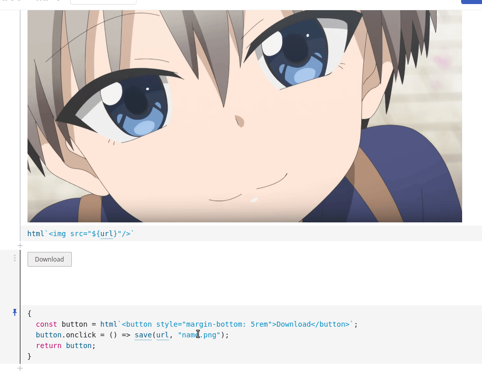

# Xave - HTML5 JS SaveAs tool

A a tiny tool to save stuff, it pens a saveAs like dialog.




```
yarn add xave
```

```
npm install xave
```

## Usage

`save(Blob|URL|URI, "name.extension")`

```js
import save from "xave"
const blob = new Blob(["xd"], { type: "text/plain" })
save(blob, "text.txt")
```

```js
const save = require("xave")
const blob = new Blob(["xd"], { type: "text/plain" })
save(blob, "text.txt")
```

### Playground and More

- [Observable](https://observablehq.com/@d3portillo/xave)
- [Source](https://github.com/D3Portillo/xave/tree/main/src)